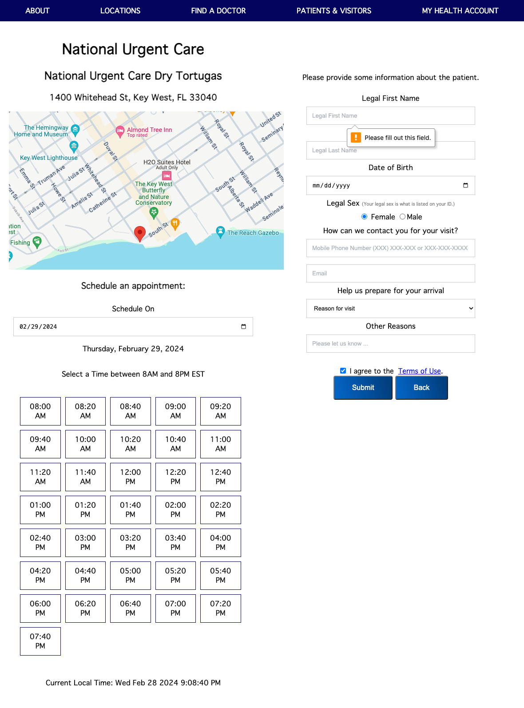
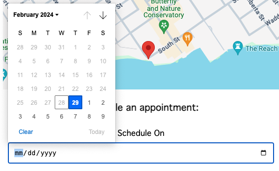
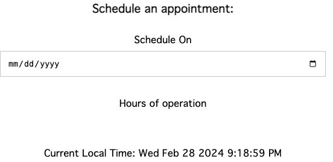
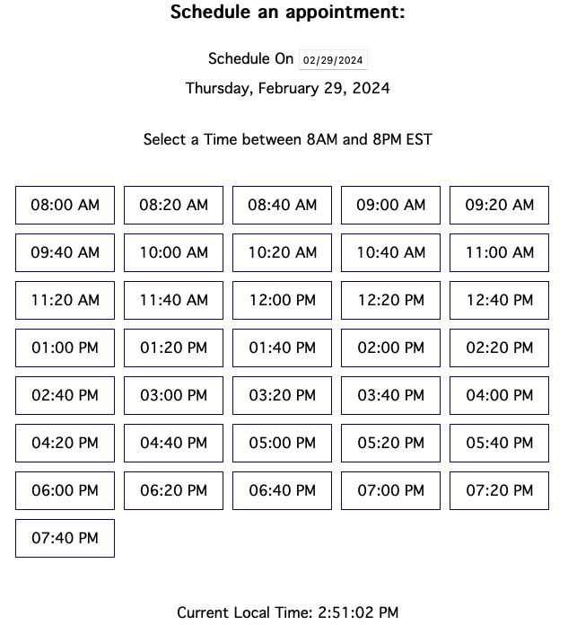
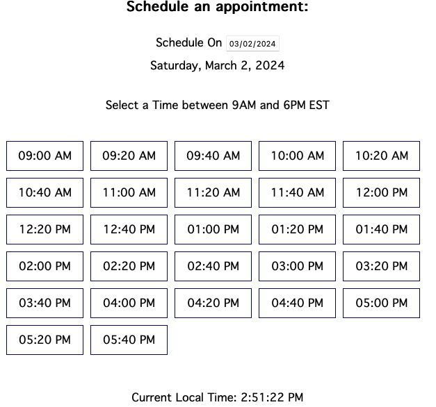
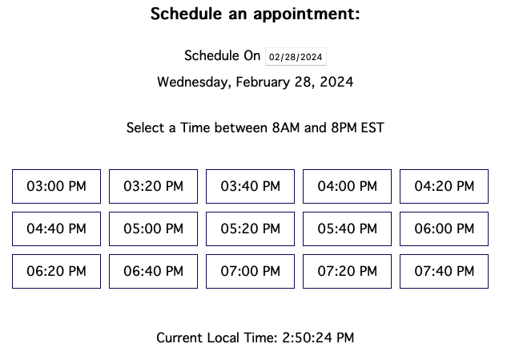
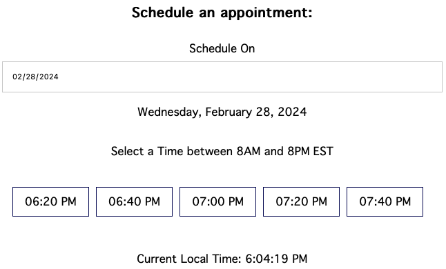
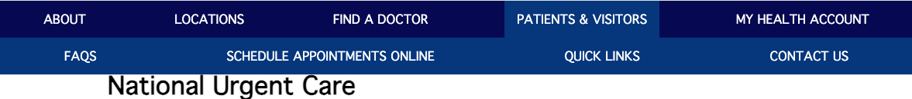
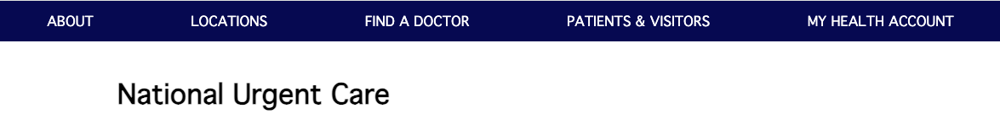

# Appointment Scheduler Web Application

This is a web application for scheduling appointments. Users can select a date and time for their appointment, view available time slots, and submit their appointment details. The application also includes a navigation bar for easy access to different sections.
  

## Features
- <strong>Date Selection</strong>: Users can select a date for their appointment using a date picker. 
 
- <strong>Time Slot Selection</strong>: Time slots are dynamically generated based on the selected date, allowing users to choose their preferred appointment time. 
    - Before selecting:  
    
    - For weekdays:  
    
    - For weekends:  
    
    - For current day, it will only show the time slots after current local time.  
      
     
- <strong>Form Validation</strong>: The application validates user input to ensure that all required fields are filled and terms are agreed upon before submission.
- <strong>Navigation Bar</strong>: A navigation bar provides access to different sections of the application, including information about the clinic, locations, doctors, and patient resources.
    - Main menu:  
     
    - Submenu:  
    

## Getting Started
To run the application locally, follow these steps:
1. Clone this repository to your local machine.
2. Open the index.html file in a web browser.
3. Select a date for your appointment and choose a time slot.
4. Fill in the required information in the appointment form.
5. Click the "Submit" button to schedule your appointment.

## Technologies Used
- HTML5
- CSS3
- JavaScript
